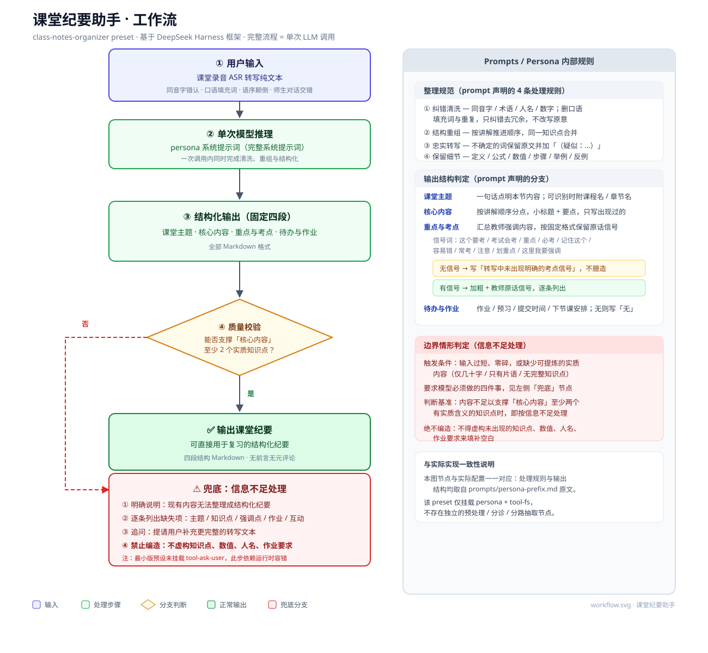

# 工作流图（Workflow）

本目录下的工作流图用于训练营提交材料与项目文档。**图中的每个节点都对应真实实现**，不包含架构中不存在的步骤。

## 资产清单

| 文件 | 说明 |
|---|---|
| [`workflow.svg`](workflow.svg) | **手绘精修版（SVG）** — 主交付物，矢量、可无损缩放，含右侧 Prompt 规则面板 |
| [`workflow.png`](workflow.png) | 手绘精修版 PNG，2395×2228，2 倍分辨率，适合截图提交 |
| [`workflow.mmd`](workflow.mmd) | **Mermaid 源码** — 后续修改的可编辑源文件 |
| [`workflow-mermaid.svg`](workflow-mermaid.svg) | 由 `.mmd` 渲染的 SVG（2040×356，横幅比例） |
| [`workflow-mermaid.png`](workflow-mermaid.png) | 由 `.mmd` 渲染的 PNG，4093×728，2 倍分辨率 |

> 两个版本内容一致，只是排版不同：手绘版是**纵向 + 规则面板**（信息密度高，适合作为文档主图）；
> Mermaid 版是**横向流程**（宽高比接近横幅，适合放进 PPT 页面）。

## 工作流图



## 节点与真实实现的对应关系

| 图中节点 | 对应实现 | 位置 |
|---|---|---|
| ① 用户输入 | 会话中粘贴的 ASR 转写文本 | — |
| ② 单次模型推理 | `persona` 插件挂载的系统提示词 | `config/preset.example.yml` → `plugins[0]` |
| Persona 内部处理规则（4 条） | 「整理规范」四条：纠错清洗 / 结构重组 / 忠实转写 / 保留细节 | `prompts/persona-prefix.md` |
| ③ 结构化输出（固定四段） | 「输出结构」四段 | `prompts/persona-prefix.md` |
| ④ 质量校验 | 「信息不足处理」中的判断基准 | `prompts/persona-prefix.md` |
| ✅ 输出课堂纪要 | 正常路径产物 | — |
| ⚠️ 兜底：信息不足处理 | 「信息不足处理」四步 + 禁止编造约束 | `prompts/persona-prefix.md` |

## ⚠️ 与原始需求的一处重要偏差（如实说明）

需求中列出的下列节点，**在当前实际配置中并不存在**，因此图中未予体现：

| 需求中的节点 | 为什么不画 |
|---|---|
| 文本预处理（去口语化、去重复、分段） | 没有独立预处理节点。纠错与去冗余发生在**同一次模型推理**内，是 persona 提示词的处理规则之一 |
| 内容分诊（判断是知识点 / 作业 / 问答 / 其他） | 没有分诊步骤，也没有分类中间产物 |
| 分路抽取（知识点 / 作业项 / 问答整理） | 没有并行抽取分支，四段输出由一次推理直接生成 |
| 输出校验（异常则返回兜底摘要） | 不存在程序化的输出校验器；「质量校验」是提示词内的**信息充足性判断基准**，兜底产物是「信息不足说明 + 缺失清单 + 追问」，不是摘要 |

**根本原因**：本 preset 只挂载两行插件 —— `persona`（提示词）与 `tool-fs`（文件读写）。
它没有工作流编排引擎、没有子 Agent、也没有多阶段流水线。**完整流程就是一次 LLM 调用**，
所有「步骤」都是提示词内声明的处理规范，而非可观测的独立执行阶段。

如果提交材料需要体现「多节点流水线」的形态，那是另一种架构（例如用 DSH 的 workflow / 子 Agent 能力重构），
当前项目并未实现，因此不宜在图中呈现，以免与真实实现不符。

## 如何修改与重新渲染

### 方式一：修改 Mermaid 源码后重新渲染

```bash
# 安装（一次性）
npm install -g @mermaid-js/mermaid-cli

# 渲染
mmdc -i docs/workflow.mmd -o docs/workflow-mermaid.svg -b white
mmdc -i docs/workflow.mmd -o docs/workflow-mermaid.png -b white -s 2
```

或直接用 npx（免安装）：

```bash
npx -y @mermaid-js/mermaid-cli -i docs/workflow.mmd -o docs/workflow-mermaid.svg -b white
```

也可以把 `workflow.mmd` 的内容粘贴到 <https://mermaid.live> 在线编辑预览。

### 方式二：另存为 PNG（仅用系统自带浏览器，无需装任何工具）

```powershell
# Windows / Edge
& "C:\Program Files (x86)\Microsoft\Edge\Application\msedge.exe" `
  --headless=new --force-device-scale-factor=2 --window-size=2040,356 `
  --screenshot="$PWD\docs\workflow-mermaid.png" `
  "file:///$PWD/docs/workflow-mermaid.svg"
```

### ⚠️ 改 `.mmd` 时务必注意（踩过的坑）

1. **第 1 行的 `init` 指令必须在文件最前面。**
2. **不要在 `flowchart` 定义之前或之后加 `%%` 注释**。mermaid-cli 12.x 会因此解析失败
   （报 `Expecting 'NEWLINE','SPACE','GRAPH'`），或在图里渲染出一个写着 `%%` 的空节点。
   因此 `workflow.mmd` 保持为**纯图表定义**，所有说明性文字都放在本文件里。
3. **不要用 YAML frontmatter**（`---` 开头）—— mermaid-cli 12.x 不支持。
4. 方向由 `flowchart LR` 控制：改成 `flowchart TD` 即为纵向流程图。

### 修改手绘 SVG 版

`workflow.svg` 是手写 SVG，结构与 `workflow.mmd` 一一对应。节点位置用绝对坐标，
直接改 `x` / `y` 属性即可；配色由 `classDef` 对应的 `fill` / `stroke` 决定。
改动后按上面「方式二」重新截图即可得到 PNG。
